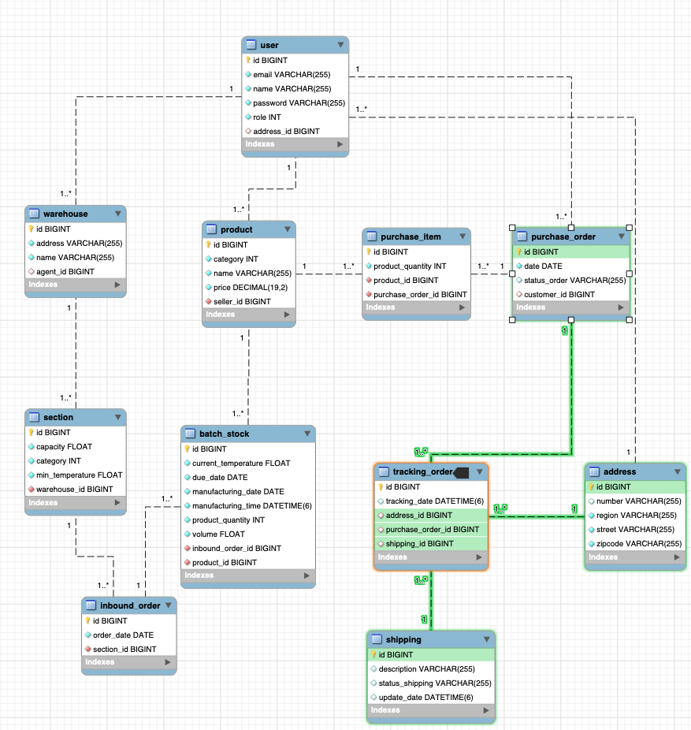

# BootCamp Backend Java - Projeto Integrador
<p>
    
    
    
</p>


### Objetivo
Este projeto tem o objetivo de adicionar uma nova funcionalidade de acompanhamento de transporte para produtos frescos,
congelados e refrigerados do Mercado Livre através de uma API REST em Java com Spring Boot e suas respectivas
dependências.

* [Enunciado Base](https://drive.google.com/file/d/1Oha8lfWwiXB6cYHB32Ppi3cB3hYWKVvE/view?usp=sharing)

### Especificações do Requisito 6

* [Requisito 6 (base)](https://drive.google.com/file/d/1il0kj0iGrPnVuko06dqxelyTiHcrkB6c/view?usp=sharing)
* [Requisito 6](https://drive.google.com/file/d/1AiZqBqJ-eLgPS38uKzSjNclZEy4UkQj5/view?usp=sharing)

### Diagrama do Projeto


---
### Links Requisito 6:
- [Anderson Alves](https://github.com/fyshinkae/meli-frescos/tree/feature/requisito-6/anderson)
- [Felipe Shinkae](https://github.com/fyshinkae/meli-frescos/tree/feature/shinkae)
- [Gabriel Viana](https://github.com/fyshinkae/meli-frescos/tree/gabriel-viana-req6)
- [Giovanna Eliz](https://github.com/fyshinkae/meli-frescos/tree/giovanna-eliz-req6)
- [Matheus Alves (Ma)](https://github.com/fyshinkae/meli-frescos/tree/matheus-alves-req-6)
- [Matheus Ferreira (Theus)](https://github.com/fyshinkae/meli-frescos/tree/matheus-ferreira-req6)
---

### Instruções para instalação
Para iniciar o projeto é necessario o Docker.
Dentro do diretório raiz do projeto, executar o comando abaixo:
```sh
docker-compose up -d 
```
Após, iniciar o projeto com o comando:
```sh
mvn spring-boot:run
```
---

### Postman

O Documento sobre a API do postman está 
[aqui](https://documenter.getpostman.com/view/23680860/2s8YsnWbGm).

O arquivo com a coleção de endpoints está 
[aqui](https://raw.githubusercontent.com/fyshinkae/meli-frescos/main/postman/desafio-frescos.postman_collection.json).

**Caso precise de instruções consulte a 
[documentação do Postman](https://learning.postman.com/docs/getting-started/importing-and-exporting-data/)**

---

## Documentação

Link da documentação deo Swagger:

```sh
http://localhost:8080/swagger-ui.html
```

---

### Equipe 7

- [Anderson Alves](https://github.com/andmalves)
- [Felipe Shinkae](https://github.com/fyshinkae)
- [Gabriel Viana](https://github.com/gabvteixeira)
- [Giovanna Eliz](https://github.com/giovannaelizs)
- [Matheus Alves (Ma)](https://github.com/matheusaralves)
- [Matheus Ferreira (Theus)](https://github.com/matheusFerreira-meli)

---
Feito com 💛 
