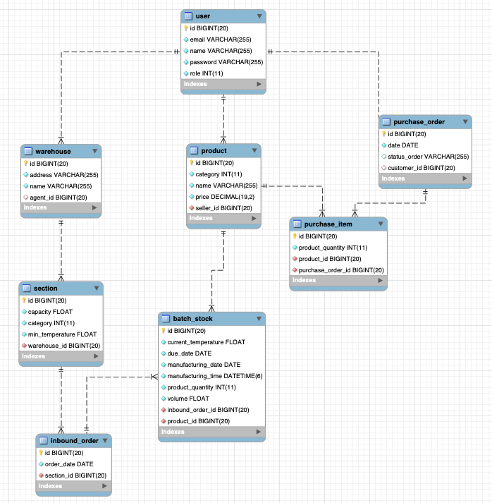

# BootCamp Backend Java - Projeto Integrador
<p>
    
    
    
</p>


### Objetivo
O objetivo deste projeto final é implementar uma API REST no âmbito do slogan e aplicar
os conteúdos trabalhados durante o BOOTCAMP MELI. (Git, Java, Spring, Banco de Dados,
Qualidade e Segurança).

* [Enunciado Base](https://drive.google.com/file/d/1Oha8lfWwiXB6cYHB32Ppi3cB3hYWKVvE/view?usp=sharing)

### Especificações de Requisitos

* [Requisito 1](https://drive.google.com/file/d/1FpDBHMdlxCwSTP6txExJIgOgcAG8ujTD/view?usp=sharing)
* [Requisito 2](https://drive.google.com/file/d/1oJgq7YcNL_KmGG-drmxEjrpRkfGsj5ft/view?usp=sharing)
* [Requisito 3](https://drive.google.com/file/d/1peHIPZG7TJ-83FOewkoL6YqQVwSUIPcr/view?usp=sharing)
* [Requisito 4](https://drive.google.com/file/d/1OC5XIy1PsnX8ulTfackc-a0w17pw2wyz/view?usp=sharing)
* [Requisito 5](https://drive.google.com/file/d/1eREsXg-O1IBD2SeKmRxlMHjyt8GsLYTs/view?usp=sharing)
* [Requisito 6](https://drive.google.com/file/d/1il0kj0iGrPnVuko06dqxelyTiHcrkB6c/view?usp=sharing)

### Diagrama do Projeto


---
### Links Requisito 6:
- [Anderson Alves](https://github.com/fyshinkae/meli-frescos/tree/feature/requisito-6/anderson)
- [Felipe Shinkae](https://github.com/fyshinkae/meli-frescos/tree/feature/shinkae)
- [Gabriel Viana](https://github.com/fyshinkae/meli-frescos/tree/gabriel-viana-req6)
- [Giovanna Eliz](https://github.com/fyshinkae/meli-frescos/tree/giovanna-eliz-req6)
- [Matheus Alves (Ma)](https://github.com/fyshinkae/meli-frescos/tree/matheus-alves-req-6)
- [Matheus Ferreira (Theus)](https://github.com/fyshinkae/meli-frescos/tree/matheus-ferreira-req6)
---

### Instruções para rodar a aplicação

:warning: É necessário ter o [Docker](https://docs.docker.com/engine/install/) e o [Docker Compose](https://docs.docker.com/compose/install/) instalados.

Dentro do diretório raiz do projeto, execute o comando abaixo:
```sh
docker-compose up -d 
```
Logo após, inicie o projeto com o comando:
```sh
mvn spring-boot:run
```
---

### Collection do Postman

O arquivo com a coleção de endpoints está [aqui](https://raw.githubusercontent.com/fyshinkae/meli-frescos/main/postman/desafio-frescos.postman_collection.json). Caso precise de instruções consulte a [documentação do Postman](https://learning.postman.com/docs/getting-started/importing-and-exporting-data/).

---

### Documentação da API

O projeto foi documentado com Swagger. A documentação pode ser acessada [aqui](http://localhost:8080/swagger-ui.html).

---

### Equipe 7

- [Anderson Alves](https://github.com/andmalves)
- [Felipe Shinkae](https://github.com/fyshinkae)
- [Gabriel Viana](https://github.com/gabvteixeira)
- [Giovanna Eliz](https://github.com/giovannaelizs)
- [Matheus Alves (Ma)](https://github.com/matheusaralves)
- [Matheus Ferreira (Theus)](https://github.com/matheusFerreira-meli)


---
Feito com 💛 
